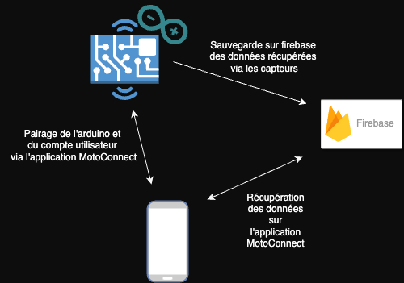
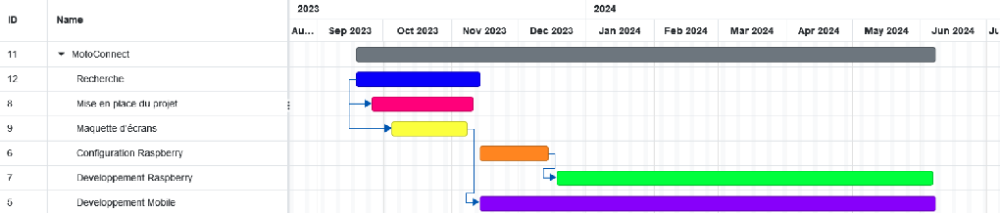

# MotoConnect

L’application mobile “MotoConnect” a pour objectif de servir d’interface de tableau de bord pour les motos en retournant les informations et statistiques d’une moto via l’application.
Par exemple sa position, ses trajets, informations de maintenance (Changement de pneu, graissage chaine, niveau liquide), etc.
En bref, toutes les informations nécessaires à l’entretien et l’utilisation quotidienne de la moto.
Les données seront récupérées par une arduino mega 2560  et ses capteurs avant d’être envoyés dans une base de données Cloud (Firestore) qui seront ensuite reprises par l’application mobile.

## Schéma de l'architecture

## Gantt

